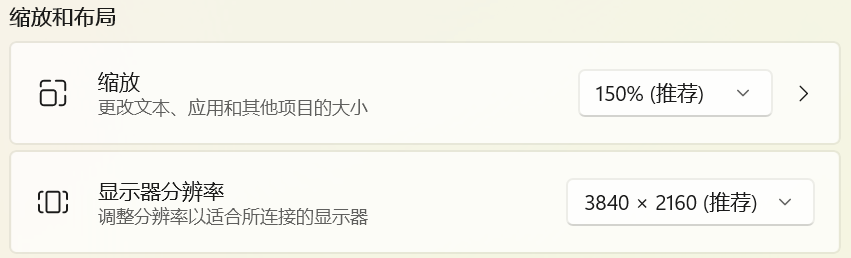

## 了解“舞台”

所有的游戏内容都是在舞台上展示的。舞台是一个矩形区域，它是游戏中所有内容的容器。对一个特定的游戏而言，舞台的大小总是固定不变的，我们称之为“舞台尺寸（stage size）”，它是一个**逻辑尺寸**。

舞台的尺寸并不直接决定最终显示的大小（即操作系统中窗口的大小）。舞台在显示时会被缩放到特定的窗口表面（surface）上，各种游戏中常见的“分辨率设置”或全屏选项即是在设置窗口表面的大小，我们称之为“表面尺寸（surface size）”，它也是一个逻辑尺寸。

:::tip[逻辑尺寸和物理尺寸]

在游戏开发中，我们通常会使用逻辑尺寸来表示游戏中的各种尺寸，而不是直接使用像素尺寸。这是因为不同的设备有不同的屏幕尺寸和像素密度（缩放比例/DPI/PPI），直接使用像素尺寸会导致游戏在不同设备上显示效果不一致。



:::

## 正确选择舞台和表面的尺寸

读到这里，或许你仍然不知道如何选择正确的舞台和表面尺寸。那么，你只要记得两点：

1. **舞台尺寸**应该是你游戏中所有内容的逻辑尺寸，比如 `1920x1080` 或 `1280x720`。如果你的 UI 设计稿使用 `1920x1080`，那么就用它没错。这样你在开发过程中可以直接使用设计稿中的坐标，而不需要进行额外的缩放计算。
2. **表面尺寸**是你窗口的**默认**大小。一般来说它应该是一个小一些的值，比如 `1280x720`。这样可以确保游戏第一次运行时在大多数设备上都能正常显示，而不会因为窗口太大而导致内容显示不全。当然，这里只是“默认”大小，在你的游戏脚本中仍旧可以通过代码随时调整窗口大小。

我们推荐使用 `1920x1080` 或 `1280x720` 作为舞台尺寸，`1280x720` 作为表面尺寸。

### 设计尺寸与高清显示

**舞台尺寸就是游戏的设计尺寸。** 它决定按钮、文本框和立绘的位置与逻辑大小。玩家运行游戏时，窗口大小、全屏状态和显示器像素密度各不相同，实际显示表面的尺寸通常与设计尺寸不同。引擎会等比缩放舞台，宽高比不一致时留边，因此调整窗口大小不需要重写游戏坐标。

例如，舞台设为 `1920x1080` 时，画面中心的舞台坐标始终为 `(960, 540)`。无论玩家使用小窗口还是 4K 全屏，这个坐标都不变。`surfaceSize` 是逻辑尺寸；计算最终显示像素数时，还需要考虑操作系统的缩放比例。

**想让画面更清晰，优先提高素材分辨率；想改变设计画布，才调整舞台尺寸。** 同样是 3840×2160 的背景文件，在不同设计画布中有不同的用途：

| 设计尺寸（`stageSize`） | 背景文件 | 素材倍率 | 逻辑显示尺寸 |
| --- | --- | --- | --- |
| `1920x1080` | `background@2x.png`（3840×2160 像素） | 2× | 1920×1080 |
| `3840x2160` | `background.png`（3840×2160 像素） | 1× | 3840×2160 |

### 重新设计 UI，还是替换默认素材？

- **重新选择设计画布**：如果你按 `3840x2160` 设计整个游戏，可以把 `stageSize` 设为这个值，并按新的设计稿调整 UI、立绘位置、相机偏移和剧本中的坐标。配套的 4K 素材是 1× 素材。仅修改配置不会自动换算已有的绝对坐标，也不会改写框架中固定的尺寸与布局。
- **保留默认设计画布**：如果你主要是替换默认框架的素材或微调位置，可以保持 `1920x1080`，从高清原稿导出 `@2x` 素材。引擎会将图片像素尺寸除以倍率，保持原来的逻辑大小；替换图的逻辑尺寸与原图一致时，已有布局不需要因分辨率提高而调整。

重新设计 UI 也可以继续使用 `1920x1080`。是否改变舞台尺寸，取决于你希望采用哪套设计坐标。

多套素材可以兼顾不同设备；只提供一套高清素材也可行，但会增加运行时内存、显存和加载开销。导出方式和配置示例见[只提供一套高清素材](/start/assets/#只提供一套高清素材)。

## 舞台与全局设置

对于一个游戏，我们首先要配置合适的全局配置，这包括前面提到的舞台相关的设置，以及其他一些全局设置，比如游戏的标题、字体等。在末语游戏引擎中，我们通常使用工程目录下的 `index.json` 文件来配置他们。

下面是一个简单的 `index.json` 文件示例：

```json title="index.json"
{
  "$schema": "https://gist.githubusercontent.com/Icemic/55a8cd86b02c0c310f51833e88f7d083/raw/moyu-config.schema.json",
  "initialSurfaceSize": "1280x720",
  "stageSize": "1920x1080",
  "windowTitle": "My First Game",
  "entryFilename": "index.js"
}
```

在这个配置文件中，我们配置了表面尺寸为 `1280x720`，舞台尺寸为 `1920x1080`，窗口标题为 `My First Game`，入口文件为 `index.js`。

:::info[关于 `$schema` 字段]

`$schema` 字段是一个特殊字段，指定配置文件的 JSON Schema，用于编辑器的自动补全和检查。通常情况下，你不需要手动修改这个字段，保持其原样即可。

:::

以下是所有可配置的字段列表：

| 字段名                     | 类型    | 默认值              | 描述                                                                                                                      |
| -------------------------- | ------- | ------------------- | ------------------------------------------------------------------------------------------------------------------------- |
| entry                      | string  | `./index.json`      | 重定向游戏入口点，可以是绝对路径或相对路径。这也指定了其他资源（assets）的根路径。通常无需设置。                          |
| entryFilename              | string  | `index.js`          | 游戏的入口文件名，相对于根路径。除非你知道自己在做什么，否则不要更改此项。                                                |
| appName                    | string  | `moyu`              | 应用名称，用于确定应用数据目录的名称。                                                                                    |
| fontFile                   | string 或 array | `fonts/default.otf` | 用于渲染文本的字体文件。路径必须相对于根路径，支持 .otf 和 .ttf 格式。数组中的字体按从前到后的顺序作为 fallback 使用。 |
| windowTitle                | string  | `moyu`              | 窗口的标题。                                                                                                              |
| windowState                | string  | `idle`              | 窗口的初始状态。可能的值：`idle`, `minimized`, `maximized`, `fullscreen`。                                                |
| windowResizable            | boolean | false               | 窗口可否任意调整大小。                                                                                                      |
| initialSurfaceSize          | string  | `1280x720`          | 表面的初始尺寸。                                                                                                              |
| stageSize                  | string  | `1280x720`          | 舞台的尺寸。                                                                                                              |
| presentMode                | string  | `recommended`       | 表面的呈现模式。可能的值：`recommended`, `autovsync`, `autonovsync`。除非你知道自己在做什么，否则不要更改此项。           |
| backend                    | string  | `auto`              | 用于渲染的后端。可能的值：`auto`, `dx12`, `vulkan`, `gles`, `metal`, `webgpu`。除非你知道自己在做什么，否则不要更改此项。 |
| <small>desiredMaximumFrameLatency</small> | number  | 2                   | 期望的最大帧延迟。除非你知道自己在做什么，否则不要更改此项。                                                              |
| backgroundColor            | string  | `transparent`       | 表面初始化时使用的背景颜色。                                                                                                |
| showFPS                    | boolean | false               | 是否显示 FPS。通常用于调试，请勿在发布版中设置。                                                                          |
| enableGamepads               | boolean | false               | 是否启用游戏手柄支持。详见[手柄与其他 API](../engine-api/misc.md)                                                                  |
| enableMSAA                 | boolean | false               | 是否启用 4 倍多重采样抗锯齿（4× MSAA），用于改善图形边缘的锯齿。                                                          |
| enableMipmaps              | boolean | false               | 是否为静态图片生成 mipmap，用于改善图片缩小时的清晰度和稳定性。                                                           |
| multiResAssets             | string 或 number | `off`         | 多倍图的选择方式。`off` 关闭（默认），`auto` 按显示倍率自动选择，数字则强制使用该倍率。详见[多倍图资源](#多倍图资源)。      |
| multiResAssetScales        | array   | `[1.5, 2]`          | 允许尝试的变体倍率，整体覆盖默认值。空数组表示只使用基础图。详见[多倍图资源](#多倍图资源)。                              |
| multiResAssetPolicy        | string  | `quality`           | 候选倍率的选择策略。`quality` 优先清晰度，`balanced` 优先显存。                                                            |
| steam                      | object  | 无                  | Steam 配置。字段说明见 [Steam API](../engine-api/steam.md)。                                                               |

### 字体 fallback

`fontFile` 默认是一个字体路径，旧写法仍然有效。需要为缺少字形的文本指定 fallback 字体时，可以将它设为数组；引擎按数组从前到后的顺序查找字形。

数组中的每一项可以是路径字符串，也可以是带可选 `alias` 和 `kind` 的对象。`alias` 用于区分同一字体文件的不同配置；`kind` 可为 `cjk` 或 `western`，用于优先选择中文或西文的对应字体。未设置 `kind` 时，仍按数组顺序选择。

```json
{
  "fontFile": [
    { "path": "fonts/SourceHanSansSC-VF.otf", "alias": "siyuan", "kind": "cjk" },
    { "path": "fonts/Inter-Variable.ttf", "alias": "inter", "kind": "western" }
  ]
}
```

:::info[可变字体]

可变字体在一个字体文件中包含多个字重和斜体样式。项目可用时，建议优先配置可变字体，以减少字体文件数量与 `fontFile` 配置项。

很多字体（如思源黑体）都提供了可变字体版本。

:::

### 多重采样抗锯齿（MSAA）

将 `enableMSAA` 设置为 `true` 后，引擎会启用 4× MSAA。它主要改善 Sprite 等图形在旋转、缩放或显示斜边时产生的锯齿，也会应用于 Filter 和 Shader 中实际绘制场景内容的部分。

MSAA 会增加 GPU 的显存占用和渲染开销。文字使用 SDF 渲染，Filter 和 Shader 自身产生的着色效果也主要由对应的着色器决定，因此开启 MSAA 通常不会明显改善这些内容。建议根据游戏画面和目标设备的性能测试结果决定是否开启。

### 静态图片 mipmap

将 `enableMipmaps` 设置为 `true` 后，引擎会在静态图片载入时生成一组逐级缩小的纹理。图片被缩小显示时，GPU 会从合适的层级采样，可以减少摩尔纹、闪烁和细节跳动，尤其适合会被大幅缩小、旋转或远距离显示的图片。

目前 mipmap 适用于通过资源管理器载入的静态图片，包括 Sprite 使用的图片和启动图。Animation、Video、文字 SDF 纹理、Filter、Backdrop、Shader 渲染目标和截图不会生成 mipmap。

生成 mipmap 会增加图片载入时的 GPU 工作量，并占用约三分之一的额外纹理显存。图片始终按接近原始尺寸显示时，收益通常不明显；如果游戏中经常缩小图片，建议开启并在目标设备上进行测试。

### 多倍图资源

游戏在高分辨率屏幕上全屏运行时，画面会被整体放大，素材只有一个尺寸时放大后就会发虚。

多倍图允许为同一张图准备多个尺寸，引擎按画面被放大的倍数挑选。例如在 4K 屏幕上全屏运行 `1920x1080` 的舞台时，画面放大 2 倍，引擎使用 `@2x` 素材；1440p 屏幕约 1.33 倍，使用 `@1.5x`。素材的命名与制作方式见[多倍图](../start/assets.mdx#多倍图)，脚本与界面中照常引用基础图，不需要改写。

这项特性默认关闭，因为引擎需要逐个尝试候选倍率，在 Web 上会产生额外的资源请求。如果游戏会在高分辨率屏幕上全屏运行，建议开启：

```json
{
  "multiResAssets": "auto"
}
```

开启后引擎按画面放大的倍数在候选档位中挑选，默认候选是 `[1.5, 2]`。需要其他档位（例如 `1.25` 或 `3`）时用 `multiResAssetScales` 声明：

| 字段                | 说明                                                                                                                        |
| ------------------- | --------------------------------------------------------------------------------------------------------------------------- |
| multiResAssets      | 默认 `off`。改为 `auto` 表示根据画面放大的倍数自动选择；设为数字（如 `2`）则强制使用该倍率的素材，可用于测试与画质对齐。 |
| multiResAssetScales | 候选档位，默认 `[1.5, 2]`。写入后整体覆盖默认值，设为 `[]` 表示只使用基础图。                                                |
| multiResAssetPolicy | `quality`（默认）优先清晰度，取不小于所需倍数的最小档位；`balanced` 优先显存，取与所需倍数最接近的档位。                 |

建议保留基础图作为回退。引擎会按顺序尝试候选文件，文件不存在或无法解码时继续尝试下一档，直到成功或候选耗尽。自动模式不会使用候选列表之外的倍率，即使对应文件存在。固定倍率模式优先尝试指定倍率，缺失时只回退到基础图。`moyu run` 与 `moyu pack` 会在启动前检查素材与配置是否匹配并给出提示。

只提供 `@2x` 等变体也能运行，具体配置与基础图缺失提示见[只提供一套高清素材](/start/assets/#只提供一套高清素材)。

:::note[自动选择发生在加载时]
显示倍率包含操作系统的像素密度，并按舞台实际占据的显示区域计算。引擎在素材加载时选择倍率；调整窗口或切换全屏后，已加载的纹理不会立即自动换档，后续加载的素材才按新的显示倍率选择。自动切换素材的能力仍在开发中。
:::

:::tip[请求开销]
默认 `quality` 策略下，显示倍率不高于 `1` 时基础图排在候选的第一位；基础图可用时，引擎不会发出变体请求。基础图缺失或优先尝试的变体缺失时，会继续读取其他候选。在 Web 上，这些尝试会产生额外的资源请求。

素材倍率明显高于所需倍数时图片会被缩小采样，可以配合 `enableMipmaps` 减少摩尔纹和闪烁。
:::
